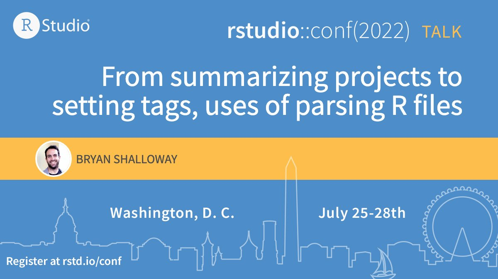

## `{funspotr}` talk @ rstudio::conf(2022)

Repo containing pdf of slides and materials for Rstudio conf 2022 talk on "From summarizing projects to setting tags, uses of parsing R files".

External links:

* Talk recording: TBD
* Package website: https://brshallo.github.io/funspotr/
* Package repo: https://github.com/brshallo/funspotr/

